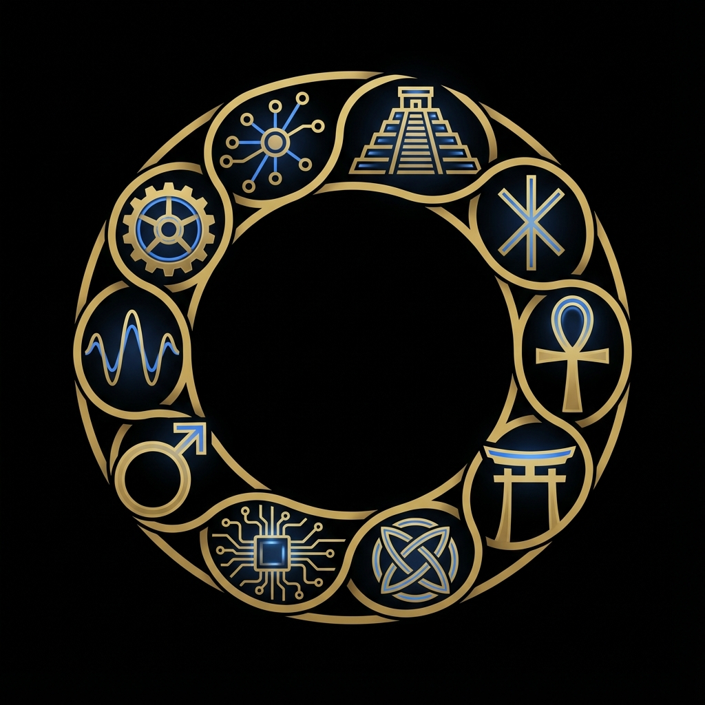
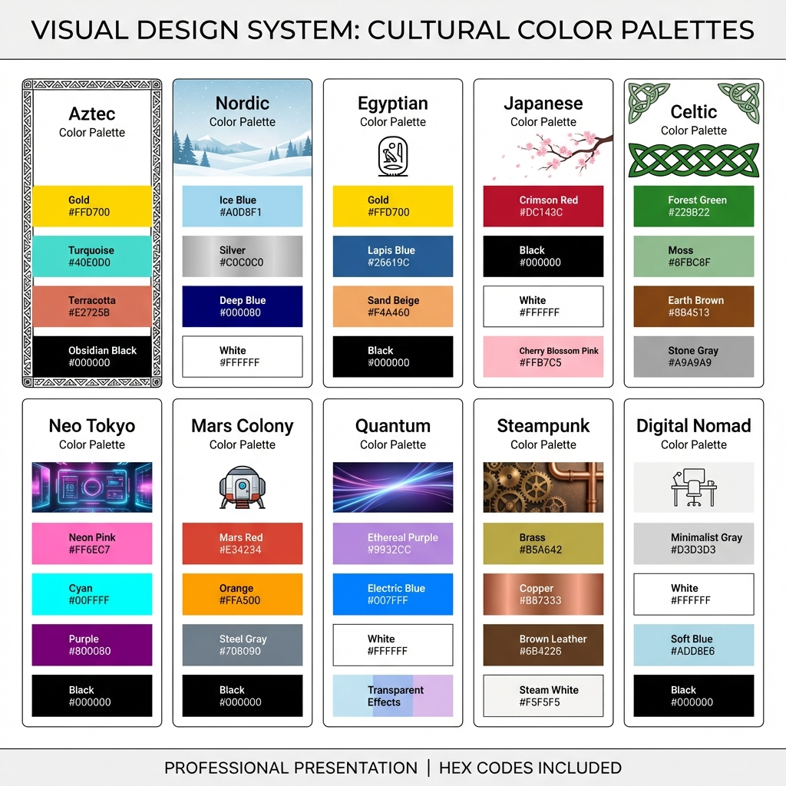
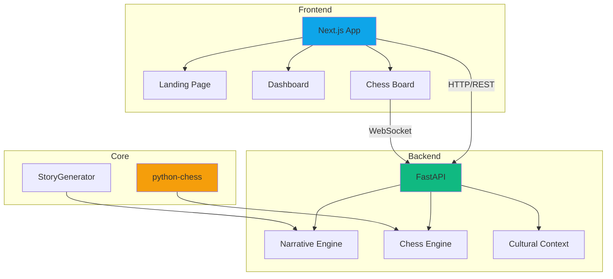

<div align="center">



# 🏰 AEON CHESS

### *Cultural Heritage Enhanced Strategic System*

**Uma plataforma de xadrez revolucionária que combina IA avançada, narrativas culturais e gamificação**

[](https://github.com/SH1W4/eon-chess-v1)
[](https://www.python.org/downloads/)
[](https://nextjs.org/)
[](https://fastapi.tiangolo.com/)
[](LICENSE)

[🎮 Demo](http://localhost:3000) • [📚 Documentação](http://localhost:8000/docs) • [🚀 Começar](#-quick-start) • [🎨 Brand Identity](http://localhost:3000/brand-showcase.html)

</div>

---

## ✨ Destaques

<table>
<tr>
<td width="50%">

### 🧠 **IA Narrativa**
Sistema único de geração de narrativas culturais que transforma cada partida em uma história épica, adaptada ao contexto histórico e cultural escolhido.

</td>
<td width="50%">

### 🎯 **Engine Avançado**
Motor de xadrez baseado em `python-chess` com análise profunda, suporte a variantes e integração com Stockfish.

</td>
</tr>
<tr>
<td width="50%">

### 🌍 **Contexto Cultural**
Jogue em diferentes períodos históricos (Medieval, Renascimento, Moderno) com narrativas adaptadas à região e era escolhidas.

</td>
<td width="50%">

### 📖 **API Documentada**
API RESTful completa com Swagger UI, permitindo fácil integração e extensão do sistema.

</td>
</tr>
</table>

---

## 🎨 Identidade Visual

O **AEON CHESS** possui um sistema de design adaptativo que transforma a interface com base no contexto cultural escolhido.

<div align="center">
  
### Pré-requisitos

- **Node.js** 16+ ([Download](https://nodejs.org/))
- **Python** 3.9+ ([Download](https://www.python.org/))
- **Git** ([Download](https://git-scm.com/))

### Instalação Rápida

```bash
# 1. Clone o repositório
git clone https://github.com/SH1W4/eon-chess-v1.git
cd eon-chess-v1

# 2. Instale as dependências
npm install
pip install -r src/api/requirements.txt

# 3. Inicie o sistema completo
python3 start_server.py
```

**Pronto!** 🎉 Acesse:
- 🎮 **Frontend:** [http://localhost:3000](http://localhost:3000)
- 📚 **API Docs:** [http://localhost:8000/docs](http://localhost:8000/docs)
- 🏠 **Dashboard:** [http://localhost:3000/dashboard.html](http://localhost:3000/dashboard.html)

---

## 🎯 Funcionalidades

### ✅ Implementado

| Recurso | Descrição | Status |
|---------|-----------|--------|
| 🏰 **Landing Page** | Interface moderna e responsiva | ✅ Completo |
| 🎮 **Tabuleiro Interativo** | Jogo de xadrez funcional com drag & drop | ✅ Completo |
| 🧠 **IA Narrativa** | Geração de histórias contextualizadas | ✅ Completo |
| 📖 **API REST** | Backend FastAPI com Swagger UI | ✅ Completo |
| 🌍 **Contextos Culturais** | Múltiplas regiões e eras históricas | ✅ Completo |
| 🎨 **Design System** | Tema dark moderno com glassmorphism | ✅ Completo |

### 🔧 Em Desenvolvimento

- 🤖 Integração com Stockfish para análise avançada
- 🏆 Sistema de conquistas e progressão
- 👥 Modo multiplayer em tempo real
- 📊 Analytics e estatísticas de partidas
- 🎓 Modo educacional com tutoriais

### 📋 Planejado

- 📱 Aplicativo mobile (React Native)
- 🌐 Internacionalização (i18n)
- 🎮 Torneios online
- 🔗 Integração com plataformas de xadrez

---

## 🏗️ Arquitetura



### 📁 Estrutura do Projeto

```
eon-chess-v1/
├── 🎨 public/              # Assets estáticos
│   ├── landing.html        # Landing page principal
│   ├── dashboard.html      # Hub de protótipos
│   ├── css/               # Estilos consolidados
│   └── web/               # Protótipos e demos
├── ⚙️ src/
│   ├── api/               # Backend FastAPI
│   │   ├── main.py        # API com Swagger UI
│   │   └── requirements.txt
│   ├── core/              # Lógica de xadrez
│   │   └── board/         # Engine python-chess
│   ├── cultural/          # Sistema de narrativas
│   │   ├── storyteller.py
│   │   └── narrative.py
│   └── pages/             # Páginas Next.js
├── 📚 docs/               # Documentação
├── 🚀 start_server.py     # Script de inicialização
└── 📖 README.md           # Este arquivo
```

---

## 🔌 API Endpoints

### 📖 Documentação Interativa

Acesse [http://localhost:8000/docs](http://localhost:8000/docs) para a documentação completa com Swagger UI.

### Principais Endpoints

#### 🏥 Health Check
```http
GET /health
```
Retorna o status do sistema e features disponíveis.

#### 🎭 Inicializar Narrativa
```http
POST /api/narrative/init
Content-Type: application/json

{
  "region": "europeu",
  "era": "medieval",
  "style": "epic",
  "language": "pt-br"
}
```

#### ♟️ Gerar Narrativa de Movimento
```http
POST /api/narrative/move
Content-Type: application/json

{
  "move_number": 1,
  "piece_type": "P",
  "color": "white",
  "from_pos": [6, 4],
  "to_pos": [4, 4],
  "is_capture": false,
  "is_check": false,
  "is_checkmate": false
}
```

---

## 🛠️ Stack Tecnológico

### Frontend
- **Framework:** Next.js 14
- **UI:** React 18, TypeScript
- **Styling:** CSS Modules, Glassmorphism
- **Chess:** chess.js, chessboard-element

### Backend
- **Framework:** FastAPI
- **Engine:** python-chess
- **Docs:** Swagger UI, ReDoc
- **Validation:** Pydantic

### DevOps
- **Versionamento:** Git, GitHub
- **Package Manager:** npm, pip
- **Linting:** ESLint, Black

---

## 📚 Documentação

- 📖 [API Documentation](http://localhost:8000/docs) - Swagger UI interativo
- 📘 [ReDoc](http://localhost:8000/redoc) - Documentação alternativa
- 📁 [FILE_STRUCTURE.md](FILE_STRUCTURE.md) - Estrutura de arquivos
- 📋 [PROJECT_MANUAL.md](PROJECT_MANUAL.md) - Manual do projeto

---

## 🤝 Contribuindo

Contribuições são bem-vindas! Siga estes passos:

1. **Fork** o projeto
2. **Crie** uma branch para sua feature (`git checkout -b feature/AmazingFeature`)
3. **Commit** suas mudanças (`git commit -m 'Add some AmazingFeature'`)
4. **Push** para a branch (`git push origin feature/AmazingFeature`)
5. **Abra** um Pull Request

### Diretrizes

- ✅ Código limpo e bem documentado
- ✅ Testes para novas funcionalidades
- ✅ Commits semânticos (feat, fix, docs, etc.)
- ✅ Respeito às convenções do projeto

---

## 🎯 Roadmap

### 2024 Q4
- [x] ✅ Sistema de narrativas culturais
- [x] ✅ API REST com documentação
- [x] ✅ Landing page moderna
- [ ] 🔄 Integração Stockfish
- [ ] 🔄 Sistema de conquistas

### 2025 Q1
- [ ] 📋 Modo multiplayer
- [ ] 📋 Aplicativo mobile
- [ ] 📋 Sistema de torneios
- [ ] 📋 Analytics avançado

---

## 📄 Licença

Este projeto está licenciado sob a **MIT License** - veja o arquivo [LICENSE](LICENSE) para detalhes.

---

## 🌟 Agradecimentos

- [python-chess](https://python-chess.readthedocs.io/) - Motor de xadrez em Python
- [chess.js](https://github.com/jhlywa/chess.js) - Lógica de xadrez em JavaScript
- [FastAPI](https://fastapi.tiangolo.com/) - Framework web moderno
- [Next.js](https://nextjs.org/) - Framework React

---

<div align="center">

**Feito com ♟️ e ❤️ por [SH1W4](https://github.com/SH1W4)**

[⬆ Voltar ao topo](#-aeon-chess)

</div>
