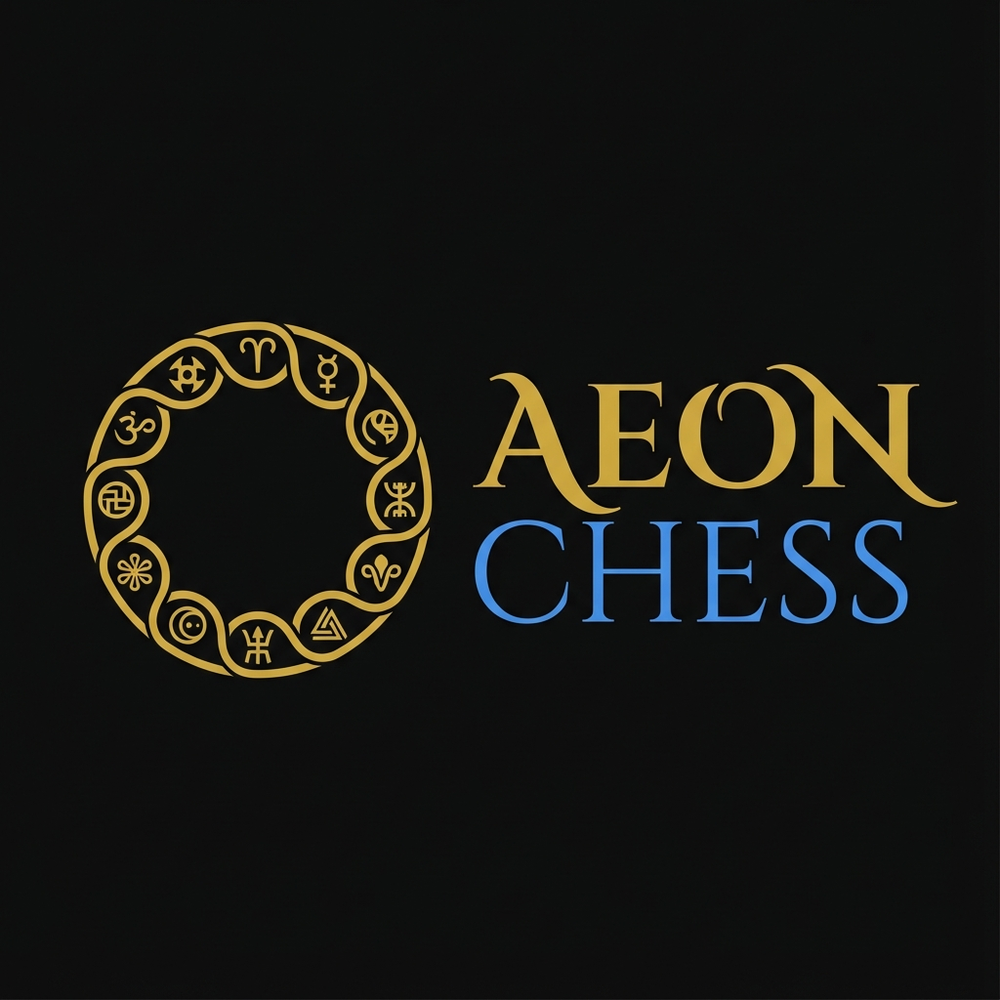

# 🎨 AEON CHESS - Brand Identity System

## 🌟 Brand Essence

**AEON CHESS** is not a chess game—it's a **cultural storytelling platform** that uses chess as a medium to explore 10 distinct civilizations across time and space.

### Core Values
- **Cultural Authenticity** - Respect and accuracy in representing diverse cultures
- **Narrative Depth** - Every move tells a story
- **Temporal Transcendence** - Connecting past, present, and future
- **Adaptive Intelligence** - AI that understands context and culture
- **Artistic Excellence** - Museum-quality aesthetic standards

---

## 🎯 Visual Identity

### Logo System

#### Primary Logo - Temporal Ring


The **Temporal Ring** represents:
- **Eternity** (AEON) - The circular form symbolizing infinite time
- **Unity** - 10 cultural symbols seamlessly integrated
- **Journey** - Continuous flow from one culture to another
- **Balance** - Sacred geometry and cosmic harmony

**Cultural Symbols Integrated:**
1. Aztec Pyramid - Sacred geometry and divine hierarchy
2. Nordic Rune - Fate and cosmic cycles
3. Egyptian Ankh - Immortality and eternal life
4. Japanese Torii - Gateway between worlds
5. Celtic Knot - Interconnectedness and cycles
6. Cyberpunk Circuit - Digital consciousness
7. Mars Symbol - Cosmic exploration
8. Quantum Wave - Probability and reality
9. Steampunk Gear - Mechanical ingenuity
10. Digital Node - Global connectivity

#### Full Logo with Wordmark


**Typography:**
- **"AEON"** - Bold, commanding presence (represents time/eternity)
- **"CHESS"** - Lighter weight (the medium, not the message)

**Usage:**
- Headers and navigation
- Marketing materials
- Social media profiles
- Documentation

---

## 🎨 Color System

### Adaptive Cultural Palettes


The interface adapts its color palette based on the selected cultural context:

#### 1. **Aztec** - Sacred Gold
```css
--primary: #D4AF37    /* Gold - Divine power */
--secondary: #40E0D0  /* Turquoise - Sacred stone */
--accent: #CD5C5C     /* Terracotta - Earth */
--dark: #1C1C1C       /* Obsidian - Mystery */
```

#### 2. **Nordic** - Ice & Steel
```css
--primary: #B0E0E6    /* Ice blue - Frozen realms */
--secondary: #C0C0C0  /* Silver - Weapons */
--accent: #4682B4     /* Deep blue - Ocean */
--dark: #2F4F4F       /* Dark slate - Night */
```

#### 3. **Egyptian** - Lapis & Gold
```css
--primary: #D4AF37    /* Gold - Pharaohs */
--secondary: #4169E1  /* Lapis blue - Royalty */
--accent: #F4A460     /* Sand - Desert */
--dark: #000000       /* Black - Night sky */
```

#### 4. **Japanese** - Crimson & Zen
```css
--primary: #DC143C    /* Crimson - Honor */
--secondary: #000000  /* Black - Discipline */
--accent: #FFB7C5     /* Cherry blossom - Beauty */
--light: #FFFFFF      /* White - Purity */
```

#### 5. **Celtic** - Forest & Stone
```css
--primary: #228B22    /* Forest green - Nature */
--secondary: #8B7355  /* Moss - Ancient wisdom */
--accent: #8B4513     /* Earth brown - Roots */
--dark: #696969       /* Stone gray - Megaliths */
```

#### 6. **Neo Tokyo 2050** - Neon Cyberpunk
```css
--primary: #FF1493    /* Neon pink - Digital energy */
--secondary: #00FFFF  /* Cyan - Technology */
--accent: #9370DB     /* Purple - AI consciousness */
--dark: #0A0A0A       /* Black - Night city */
```

#### 7. **Mars Colony** - Red Planet
```css
--primary: #CD5C5C    /* Mars red - Planet surface */
--secondary: #FF8C00  /* Orange - Terraforming */
--accent: #708090     /* Steel gray - Technology */
--dark: #1C1C1C       /* Black - Space */
```

#### 8. **Quantum Realm** - Ethereal Purple
```css
--primary: #9370DB    /* Ethereal purple - Quantum */
--secondary: #4169E1  /* Electric blue - Energy */
--accent: #FFFFFF     /* White - Pure probability */
--effect: rgba(147, 112, 219, 0.3) /* Transparent glow */
```

#### 9. **Steampunk Victoria** - Brass & Steam
```css
--primary: #B87333    /* Brass - Mechanisms */
--secondary: #CD7F32  /* Copper - Pipes */
--accent: #8B4513     /* Brown leather - Victorian */
--light: #F5F5DC      /* Steam white - Vapor */
```

#### 10. **Digital Nomad** - Minimalist Modern
```css
--primary: #808080    /* Gray - Minimalism */
--secondary: #FFFFFF  /* White - Clarity */
--accent: #87CEEB     /* Soft blue - Digital sky */
--dark: #000000       /* Black - Focus */
```

### Base Palette (Default/Landing)
```css
--bg-primary: #0a0a0a      /* Deep black */
--bg-secondary: #111111    /* Slightly lighter */
--text-primary: #ffffff    /* Pure white */
--text-secondary: #a3a3a3  /* Gray */
--accent-gold: #D4AF37     /* Luxurious gold */
--accent-blue: #3b82f6     /* Vibrant blue */
--border: #2a2a2a          /* Subtle borders */
```

---

## ✍️ Typography System

### Font Families

#### Primary - **Inter**
Modern, clean, highly legible sans-serif for UI and body text.
```css
font-family: 'Inter', -apple-system, BlinkMacSystemFont, sans-serif;
```

**Weights:**
- 300 (Light) - Subtle text, captions
- 400 (Regular) - Body text
- 500 (Medium) - Emphasized text
- 600 (Semibold) - Subheadings
- 700 (Bold) - Headings
- 800 (Extrabold) - Hero text

#### Secondary - **Georgia** (Chess Theme)
Classic serif for chess-specific elements and traditional contexts.
```css
font-family: 'Georgia', serif;
```

#### Cultural Variants
Each culture can have optional decorative fonts for headers:
- **Aztec** - Geometric, angular
- **Nordic** - Runic-inspired
- **Egyptian** - Hieroglyphic elements
- **Japanese** - Clean, minimal
- **Celtic** - Organic, flowing
- **Cyberpunk** - Futuristic, digital
- **Steampunk** - Victorian, ornate

---

## 🎭 Design Principles

### 1. **Cultural Authenticity Over Aesthetics**
Never use cultural symbols as mere decoration. Each element must have meaning and respect the source culture.

### 2. **Narrative-First Design**
Every visual element should support storytelling. Ask: "What story does this tell?"

### 3. **Temporal Fluidity**
Designs should feel timeless—equally at home in ancient civilizations and future worlds.

### 4. **Minimalism with Depth**
Clean, uncluttered interfaces that reveal complexity through interaction.

### 5. **Adaptive Contexts**
The interface transforms based on cultural context, not just color swaps but complete thematic shifts.

---

## 📐 Layout & Spacing

### Grid System
- **Base unit:** 8px
- **Container max-width:** 1280px
- **Breakpoints:**
  - Mobile: 320px - 767px
  - Tablet: 768px - 1023px
  - Desktop: 1024px+

### Spacing Scale
```css
--space-xs: 4px
--space-sm: 8px
--space-md: 16px
--space-lg: 24px
--space-xl: 32px
--space-2xl: 48px
--space-3xl: 64px
```

---

## 🎨 Visual Effects

### Glassmorphism
```css
background: rgba(17, 17, 17, 0.8);
backdrop-filter: blur(20px);
border: 1px solid rgba(255, 255, 255, 0.1);
```

### Subtle Animations
- **Fade in:** 0.6s ease-out
- **Hover lift:** translateY(-2px) in 0.2s
- **Cultural transition:** 1.2s ease-in-out (when switching contexts)

### Shadows
```css
--shadow-sm: 0 1px 2px rgba(0, 0, 0, 0.25);
--shadow-md: 0 4px 6px rgba(0, 0, 0, 0.3);
--shadow-lg: 0 10px 15px rgba(0, 0, 0, 0.4);
--shadow-xl: 0 20px 25px rgba(0, 0, 0, 0.5);
```

---

## 🚫 What to Avoid

### ❌ Don't
- Generic "AI futuristic" clichés (neural networks, circuit boards as decoration)
- Literal chess piece imagery everywhere
- Mixing cultural symbols without context
- Bright, gamified colors (this is not a casual game)
- Comic Sans or playful fonts
- Stock photos of chess boards

### ✅ Do
- Use cultural symbols with respect and meaning
- Embrace negative space and minimalism
- Let the narrative guide the design
- Maintain sophistication and elegance
- Think "museum exhibit" not "mobile game"
- Use authentic cultural references

---

## 📱 Applications

### Website
- Adaptive header with cultural context selector
- Smooth transitions between cultural themes
- Narrative-driven content hierarchy

### Marketing
- Social media banners that showcase cultural diversity
- Video content with cinematic quality
- Educational content about cultures and chess

### In-Game UI
- Minimal HUD that doesn't distract from narrative
- Cultural-specific piece designs
- Narrative text integrated naturally

---

## 🎯 Brand Voice

### Tone
- **Sophisticated** - Not casual or playful
- **Educational** - Informative without being academic
- **Respectful** - Honoring all cultures equally
- **Mysterious** - Inviting exploration and discovery
- **Timeless** - Avoiding trendy language

### Language
- Use "experience" not "game"
- Use "journey" not "level"
- Use "cultural context" not "theme"
- Use "narrative" not "story mode"

---

## 📚 Resources

### Assets Location
```
public/assets/branding/
├── logo-symbol.png          # Temporal ring logo
├── logo-full.png            # Full wordmark logo
├── color-palettes.png       # Cultural color systems
└── [future assets]
```

### Design Files
- Logo source files (SVG preferred)
- Cultural icon sets
- Typography specimens
- Color palette exports

---

## 🔄 Version History

- **v1.0** (2025-11-29) - Initial brand identity system
  - Temporal Ring logo concept
  - 10 cultural color palettes
  - Typography system
  - Design principles

---

**Remember:** AEON CHESS is a **cultural storytelling platform**, not a chess game. Every design decision should reflect this core truth.
