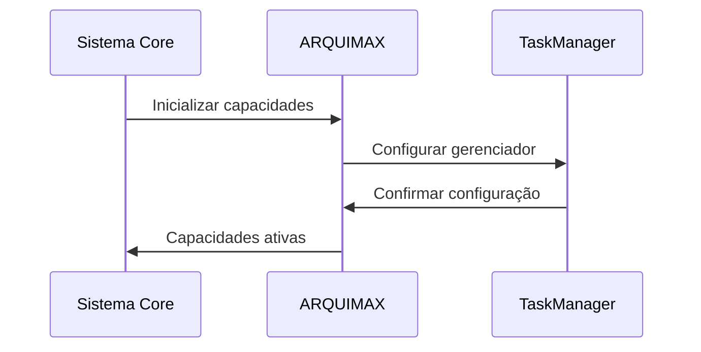
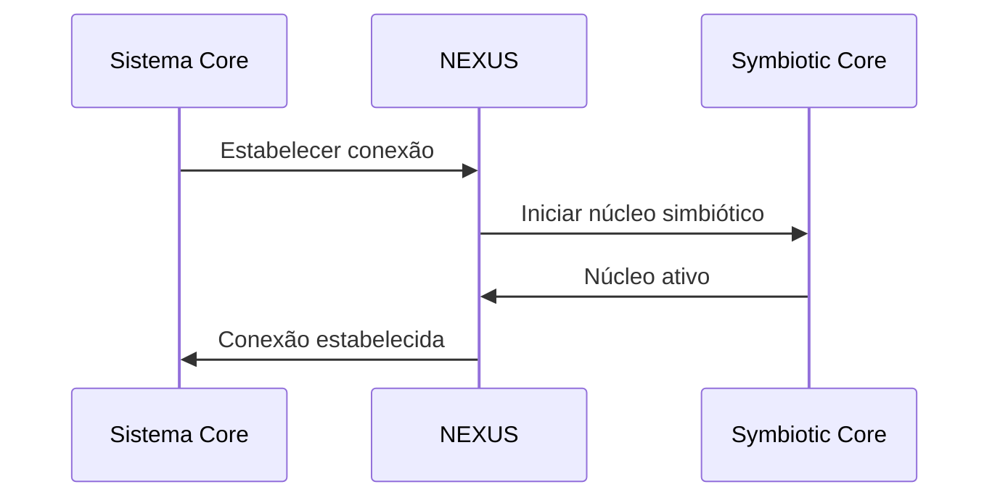
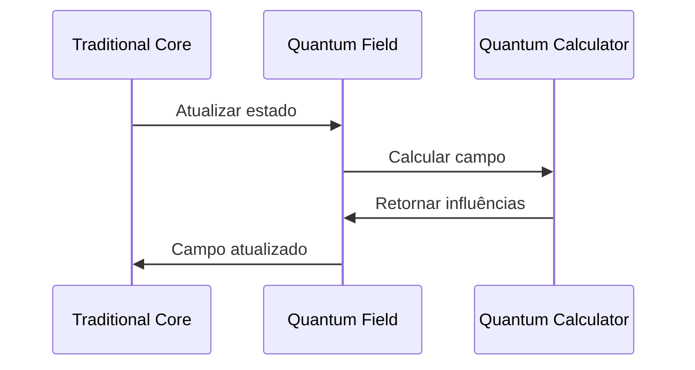
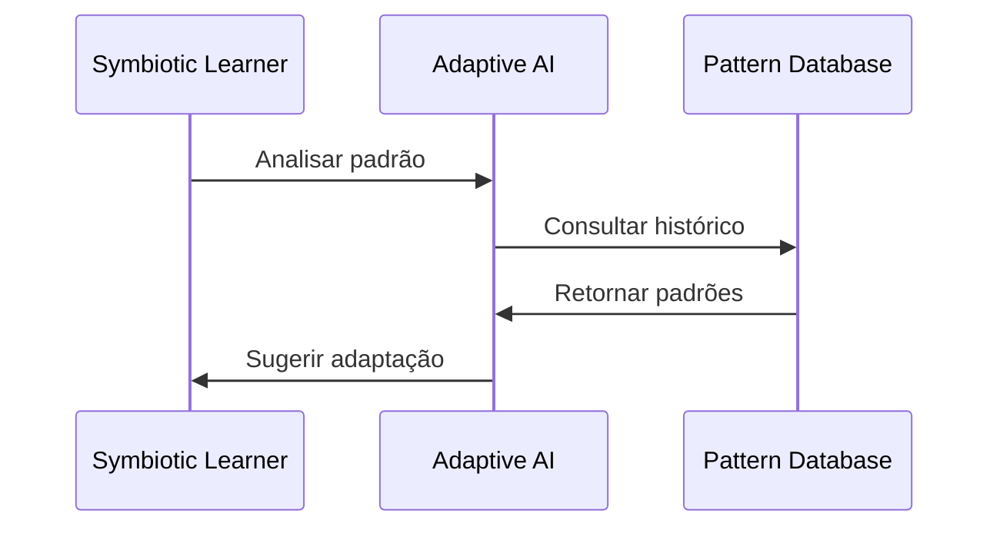

# Fluxos de Integração AEON Chess

## 1. ARQUIMAX → Core

### 1.1 Inicialização


### 1.2 Ciclo de Execução
1. Core solicita análise de posição
2. ARQUIMAX ativa TaskManager
3. TaskManager processa requisição
4. Resultados são retornados ao Core

### 1.3 Monitoramento
- Performance em tempo real
- Métricas de execução
- Alertas de saúde
- Logs de sistema

## 2. NEXUS → Core

### 2.1 Conectividade


### 2.2 Ciclo Simbiótico
1. Core envia estado atual
2. NEXUS processa informações
3. Sistema simbiótico evolui
4. Mudanças são aplicadas

### 2.3 Evolução
- Aprendizado contínuo
- Adaptação de estratégias
- Emergência de comportamentos
- Auto-otimização

## 3. Quantum → Traditional

### 3.1 Campo Quântico


### 3.2 Superposição
1. Estado tradicional é mapeado
2. Campo quântico é calculado
3. Estados são sobrepostos
4. Resultado é interpretado

### 3.3 Entrelaçamento
- Peças entrelaçadas
- Influências não-locais
- Estados quânticos
- Colapso controlado

## 4. Symbiotic Learning

### 4.1 Processo de Aprendizado


### 4.2 Ciclo Adaptativo
1. Padrões são identificados
2. Estratégias são avaliadas
3. Sistema se adapta
4. Resultados são medidos

### 4.3 Evolução Contínua
- Métricas de aprendizado
- Ajuste de parâmetros
- Otimização de recursos
- Emergência de padrões

## 5. Pipeline de Integração

### 5.1 Fluxo Principal
```yaml
pipeline:
  stages:
    - name: bootstrap
      steps:
        - arquimax_init
        - nexus_connect
        - quantum_field_setup
        
    - name: execution
      steps:
        - state_processing
        - quantum_calculation
        - symbiotic_learning
        
    - name: evolution
      steps:
        - pattern_analysis
        - strategy_adaptation
        - system_optimization
```

### 5.2 Métricas de Integração
- Taxa de sucesso: >95%
- Latência: <100ms
- Uso de recursos: <60%
- Índice simbiótico: >0.8

### 5.3 Monitoramento
- Logs centralizados
- Métricas em tempo real
- Alertas automáticos
- Dashboard de status

## 6. Manutenção e Suporte

### 6.1 Rotinas de Manutenção
- Backup diário
- Verificação de integridade
- Otimização de recursos
- Limpeza de cache

### 6.2 Procedimentos de Suporte
1. Monitoramento 24/7
2. Alertas automáticos
3. Resolução proativa
4. Documentação atualizada

### 6.3 Plano de Recuperação
- Pontos de restauração
- Procedimentos de rollback
- Redundância de sistemas
- Contingência operacional

## 7. Considerações de Segurança

### 7.1 Proteção de Dados
- Criptografia em repouso
- Criptografia em trânsito
- Controle de acesso
- Auditoria de ações

### 7.2 Integridade do Sistema
- Verificação de assinaturas
- Validação de estados
- Proteção contra interferência
- Monitoramento de anomalias

### 7.3 Compliance
- GDPR ready
- Logs auditáveis
- Políticas documentadas
- Controles implementados
