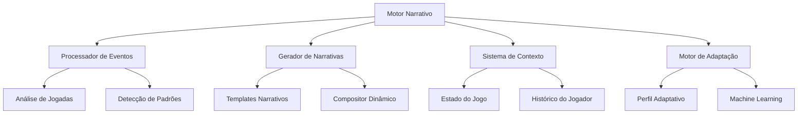

# Guia do Motor Narrativo - AEON Chess

## Introdução

O Motor Narrativo do AEON Chess é o coração pulsante que transforma partidas de xadrez em experiências narrativas únicas e adaptativas. Este guia detalha sua arquitetura, funcionamento e integração.

## Arquitetura do Motor

### Componentes Principais



### Fluxo de Processamento

```python
# Exemplo de fluxo principal
class NarrativeEngine:
    def process_move(self, move, game_state):
        # 1. Análise do movimento
        event = self.analyze_move(move, game_state)
        
        # 2. Contextualização
        context = self.build_context(event, game_state)
        
        # 3. Geração narrativa
        narrative = self.generate_narrative(event, context)
        
        # 4. Adaptação
        narrative = self.adapt_to_player(narrative)
        
        # 5. Renderização
        return self.render_narrative(narrative)
```

## Eventos e Triggers

### Hierarquia de Eventos

```yaml
eventos:
  nivel_1_criticos:
    - xeque_mate
    - abandono
    - empate
    prioridade: maxima
    
  nivel_2_majores:
    - xeque
    - captura_peca_maior
    - promocao
    - roque
    prioridade: alta
    
  nivel_3_taticos:
    - fork
    - pin
    - skewer
    - descoberta
    prioridade: media
    
  nivel_4_basicos:
    - movimento_simples
    - captura_peao
    - desenvolvimento
    prioridade: baixa
```

### Sistema de Detecção

```typescript
interface EventDetector {
  detectEvents(move: Move, board: Board): GameEvent[];
  prioritizeEvents(events: GameEvent[]): GameEvent[];
  enrichWithContext(event: GameEvent, history: MoveHistory): EnrichedEvent;
}

class ChessEventDetector implements EventDetector {
  detectEvents(move: Move, board: Board): GameEvent[] {
    const events: GameEvent[] = [];
    
    // Verifica xeque
    if (board.isCheck()) {
      events.push({
        type: 'CHECK',
        severity: 'HIGH',
        piece: move.piece,
        target: board.getKing(board.currentPlayer)
      });
    }
    
    // Verifica captura
    if (move.captured) {
      events.push({
        type: 'CAPTURE',
        severity: this.getCaptureSeverity(move.captured),
        attacker: move.piece,
        victim: move.captured
      });
    }
    
    // Verifica padrões táticos
    const patterns = this.detectTacticalPatterns(move, board);
    events.push(...patterns);
    
    return events;
  }
}
```

## Templates Narrativos

### Estrutura de Templates

```json
{
  "template_id": "dramatic_sacrifice",
  "conditions": {
    "event_type": "SACRIFICE",
    "piece_value": ">=5",
    "game_phase": "MIDDLE_GAME"
  },
  "narrative_elements": {
    "opening": [
      "Em um momento de clareza visionária,",
      "Com coragem que desafia a lógica,"
    ],
    "action": [
      "{piece} se oferece em sacrifício",
      "{piece} abraça seu destino heroico"
    ],
    "consequence": [
      "abrindo caminho para a vitória.",
      "selando o destino da batalha."
    ]
  },
  "intensity": 85,
  "themes": ["sacrifice", "heroism", "strategy"]
}
```

### Sistema de Composição

```python
class NarrativeComposer:
    def __init__(self):
        self.templates = TemplateLibrary()
        self.grammar = NarrativeGrammar()
        
    def compose(self, event: Event, context: Context) -> Narrative:
        # Seleciona template apropriado
        template = self.select_template(event, context)
        
        # Preenche variáveis
        narrative = self.fill_template(template, event, context)
        
        # Aplica regras gramaticais
        narrative = self.grammar.process(narrative)
        
        # Adiciona floreios contextuais
        narrative = self.add_flourishes(narrative, context)
        
        return narrative
        
    def select_template(self, event: Event, context: Context) -> Template:
        candidates = self.templates.get_matching(event.type)
        
        # Filtra por contexto
        candidates = [t for t in candidates 
                     if t.matches_context(context)]
        
        # Seleciona baseado em variedade e adequação
        return self.weighted_selection(candidates, context)
```

## Contextualização Dinâmica

### Fatores de Contexto

```typescript
interface GameContext {
  // Estado atual
  currentPhase: 'opening' | 'middlegame' | 'endgame';
  materialBalance: number;
  positionalAdvantage: number;
  timeRemaining: number;
  
  // Histórico
  moveCount: number;
  captureStreak: number;
  checkCount: number;
  blunderCount: number;
  
  // Tendências
  aggressionLevel: number;
  complexityTrend: 'increasing' | 'stable' | 'decreasing';
  momentum: 'player' | 'opponent' | 'balanced';
}
```

### Motor de Contexto

```python
class ContextEngine:
    def build_context(self, game_state: GameState) -> GameContext:
        return {
            'phase': self.determine_phase(game_state),
            'tension': self.calculate_tension(game_state),
            'momentum': self.analyze_momentum(game_state),
            'themes': self.extract_themes(game_state),
            'player_style': self.identify_style(game_state)
        }
    
    def determine_phase(self, state: GameState) -> str:
        pieces = state.count_pieces()
        moves = state.move_count
        
        if moves < 10 or pieces > 28:
            return 'opening'
        elif pieces < 16:
            return 'endgame'
        else:
            return 'middlegame'
    
    def calculate_tension(self, state: GameState) -> float:
        factors = [
            self.material_imbalance(state) * 0.3,
            self.king_safety(state) * 0.4,
            self.time_pressure(state) * 0.2,
            self.tactical_complexity(state) * 0.1
        ]
        return sum(factors)
```

## Sistema de Adaptação

### Perfis de Jogador

```yaml
perfis:
  iniciante:
    complexidade_narrativa: baixa
    frequencia_narrativa: alta
    tom_preferido: encorajador
    detalhamento_tecnico: minimo
    
  intermediario:
    complexidade_narrativa: media
    frequencia_narrativa: moderada
    tom_preferido: balanceado
    detalhamento_tecnico: moderado
    
  avancado:
    complexidade_narrativa: alta
    frequencia_narrativa: seletiva
    tom_preferido: analitico
    detalhamento_tecnico: completo
    
  mestre:
    complexidade_narrativa: maxima
    frequencia_narrativa: minima
    tom_preferido: sutil
    detalhamento_tecnico: preciso
```

### Motor de Adaptação

```typescript
class AdaptationEngine {
  private playerProfile: PlayerProfile;
  private learningModel: NarrativeLearningModel;
  
  adaptNarrative(
    narrative: Narrative, 
    context: GameContext
  ): AdaptedNarrative {
    // Ajusta complexidade
    narrative = this.adjustComplexity(narrative);
    
    // Personaliza tom
    narrative = this.personalizeTone(narrative);
    
    // Aplica preferências aprendidas
    narrative = this.applyLearnedPreferences(narrative);
    
    // Otimiza timing
    narrative = this.optimizeTiming(narrative, context);
    
    return narrative;
  }
  
  learn(feedback: PlayerFeedback): void {
    this.learningModel.update(feedback);
    this.playerProfile.evolve(feedback);
  }
}
```

## Integração com Sistemas

### API do Motor

```typescript
// Interface principal
interface INarrativeEngine {
  // Inicialização
  initialize(config: EngineConfig): Promise<void>;
  
  // Processamento
  processMove(move: Move, state: GameState): NarrativeResponse;
  processEvent(event: GameEvent): NarrativeResponse;
  
  // Configuração
  setProfile(profile: PlayerProfile): void;
  updateSettings(settings: NarrativeSettings): void;
  
  // Feedback
  receiveFeedback(feedback: Feedback): void;
  
  // Consultas
  getHistory(): NarrativeHistory;
  getMetrics(): NarrativeMetrics;
}
```

### Exemplo de Uso

```typescript
// Inicialização
const engine = new NarrativeEngine();
await engine.initialize({
  language: 'pt-BR',
  theme: 'epic',
  adaptiveMode: true
});

// Configuração de perfil
engine.setProfile({
  skillLevel: 'intermediate',
  preferredStyle: 'dramatic',
  narrativeFrequency: 'moderate'
});

// Processamento de jogada
const move = game.makeMove('e2e4');
const narrative = engine.processMove(move, game.getState());

// Renderização
ui.displayNarrative(narrative);

// Feedback do jogador
engine.receiveFeedback({
  narrativeId: narrative.id,
  rating: 4,
  engagement: 'high',
  readComplete: true
});
```

## Otimização de Performance

### Estratégias de Cache

```python
class NarrativeCache:
    def __init__(self, max_size=1000):
        self.cache = LRUCache(max_size)
        self.precomputed = {}
        
    def get_or_compute(self, event: Event, context: Context) -> Narrative:
        cache_key = self.generate_key(event, context)
        
        # Verifica cache
        if cache_key in self.cache:
            return self.adapt_cached(self.cache[cache_key], context)
        
        # Computa nova narrativa
        narrative = self.compute_narrative(event, context)
        self.cache[cache_key] = narrative
        
        return narrative
```

### Processamento Assíncrono

```typescript
class AsyncNarrativeProcessor {
  private queue: EventQueue;
  private workers: WorkerPool;
  
  async processEventAsync(event: GameEvent): Promise<Narrative> {
    // Eventos críticos: processamento síncrono
    if (event.priority === 'CRITICAL') {
      return this.processImmediate(event);
    }
    
    // Outros eventos: fila assíncrona
    return this.queueForProcessing(event);
  }
  
  private async queueForProcessing(event: GameEvent): Promise<Narrative> {
    const job = this.queue.enqueue(event);
    const worker = await this.workers.getAvailable();
    
    return worker.process(job);
  }
}
```

## Testes e Validação

### Suite de Testes

```python
class NarrativeEngineTests:
    def test_event_detection(self):
        """Testa detecção correta de eventos"""
        board = Board.from_fen("r1bqkb1r/pppp1ppp/2n2n2/1B2p3/4P3/5N2/PPPP1PPP/RNBQK2R")
        move = Move("Bxc6")  # Captura
        
        events = self.engine.detect_events(move, board)
        
        assert any(e.type == 'CAPTURE' for e in events)
        assert any(e.piece == 'BISHOP' for e in events)
    
    def test_narrative_coherence(self):
        """Testa coerência narrativa através de uma partida"""
        game = self.load_sample_game()
        narratives = []
        
        for move in game.moves:
            narrative = self.engine.process_move(move, game.state)
            narratives.append(narrative)
        
        # Verifica progressão de intensidade
        intensities = [n.intensity for n in narratives]
        assert intensities[-1] > intensities[0]  # Clímax no final
        
        # Verifica consistência temática
        themes = set()
        for n in narratives:
            themes.update(n.themes)
        assert len(themes) < 10  # Não muito disperso
```

### Métricas de Qualidade

```yaml
metricas:
  engagement:
    - taxa_leitura_completa
    - tempo_medio_leitura
    - interacoes_narrativa
    
  qualidade:
    - coerencia_tematica
    - progressao_dramatica
    - relevancia_contextual
    
  performance:
    - latencia_geracao
    - uso_memoria
    - taxa_cache_hit
    
  adaptacao:
    - precisao_perfil
    - satisfacao_usuario
    - taxa_aprendizado
```

## Configuração e Customização

### Arquivo de Configuração

```json
{
  "narrative_engine": {
    "version": "1.0.0",
    "settings": {
      "language": "pt-BR",
      "theme": "epic_fantasy",
      "intensity_range": [0, 100],
      "adaptive_mode": true,
      "cache_size": 1000,
      "async_processing": true
    },
    "templates": {
      "directory": "./templates/narratives",
      "custom_enabled": true,
      "fallback_mode": "generic"
    },
    "adaptation": {
      "learning_rate": 0.1,
      "profile_update_frequency": 10,
      "min_feedback_for_adaptation": 5
    },
    "performance": {
      "max_processing_time_ms": 100,
      "precompute_common_events": true,
      "worker_threads": 4
    }
  }
}
```

### Customização de Templates

```python
# Registro de template customizado
engine.register_template({
    'id': 'custom_epic_checkmate',
    'event': 'CHECKMATE',
    'template': '''
    O silêncio cai sobre o tabuleiro como uma névoa densa.
    {winner} ergue-se vitorioso, enquanto {loser} reconhece 
    a maestria de seu oponente. A batalha termina não com 
    violência, mas com o reconhecimento mútuo de uma mente
    superior. O rei cai, mas a lenda nasce.
    ''',
    'variables': ['winner', 'loser'],
    'intensity': 100,
    'themes': ['victory', 'respect', 'legend']
})
```

## Roadmap de Recursos

### v1.1 - Narrativas Expandidas
- [ ] 500+ templates narrativos
- [ ] Suporte multi-idioma
- [ ] Narrativas procedurais
- [ ] Integração com lore expandido

### v1.2 - Inteligência Avançada
- [ ] GPT integration para narrativas únicas
- [ ] Análise de sentimento em tempo real
- [ ] Previsão de engajamento
- [ ] Personalização profunda

### v1.3 - Multimodalidade
- [ ] Narrativas em áudio (TTS)
- [ ] Efeitos visuais sincronizados
- [ ] Música adaptativa
- [ ] Feedback háptico

### v2.0 - Metanarrativas
- [ ] Histórias entre partidas
- [ ] Campanha narrativa
- [ ] Universo compartilhado
- [ ] Criação colaborativa

## Troubleshooting

### Problemas Comuns

```yaml
problema: "Narrativas repetitivas"
solucoes:
  - Aumentar variedade de templates
  - Verificar sistema de cache
  - Ajustar algoritmo de seleção
  
problema: "Latência alta"
solucoes:
  - Ativar processamento assíncrono
  - Otimizar templates complexos
  - Aumentar cache size
  
problema: "Narrativas inadequadas"
solucoes:
  - Revisar perfil do jogador
  - Calibrar sistema de adaptação
  - Verificar contexto do jogo
```

## Conclusão

O Motor Narrativo do AEON Chess é mais que um sistema de mensagens - é um contador de histórias adaptativo que transforma cada partida em uma experiência única. Sua arquitetura modular e sistemas inteligentes garantem narrativas relevantes, envolventes e personalizadas para cada jogador.

---

*Para suporte técnico e contribuições, consulte a documentação técnica completa.*
