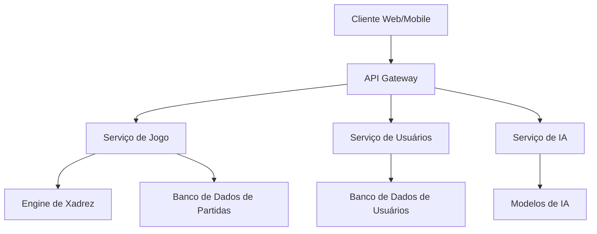
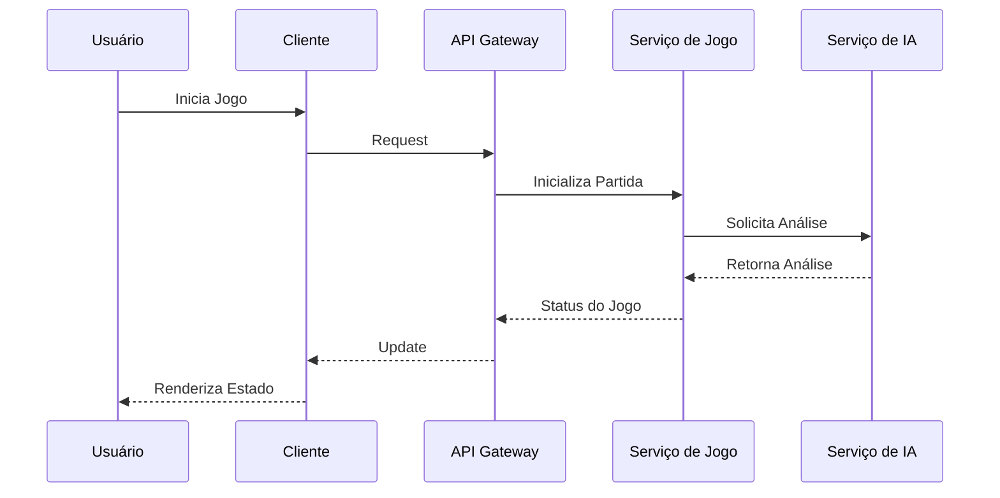

# Arquitetura do AEON Chess

## 🏗️ Visão Geral

O AEON Chess é construído com uma arquitetura modular e escalável, permitindo fácil manutenção e extensão do sistema.

## 🔍 Componentes Principais

### 1. Frontend (Cliente)
- Interface Web (React/Next.js)
- Interface Mobile (React Native)
- WebGL para renderização do tabuleiro 3D
- WebSocket para comunicação em tempo real

### 2. Backend
- API Gateway (Node.js/Express)
- Serviço de Jogo (Go)
- Serviço de Usuários (Node.js)
- Serviço de IA (Python)

### 3. Engine de Xadrez
- Implementação em Go
- Regras customizadas para personagens especiais
- Sistema de validação de movimentos
- Análise de posição

### 4. Inteligência Artificial
- Modelos de ML para análise de jogadas
- Sistema de recomendação de movimentos
- Aprendizado por reforço para NPCs
- Análise de padrões de jogo

## 💾 Persistência de Dados

### Bancos de Dados
- MongoDB para dados de usuário
- PostgreSQL para dados de partidas
- Redis para cache e sessões
- MinIO para assets

### Schemas Principais
- Usuários
- Partidas
- Personagens
- Rankings
- Achievements

## 🔒 Segurança

- Autenticação JWT
- Comunicação SSL/TLS
- Rate Limiting
- Validação de Input
- Prevenção contra cheating

## 🚀 Escalabilidade

- Arquitetura de Microserviços
- Load Balancing
- Caching em múltiplas camadas
- Auto-scaling baseado em demanda

## 📡 Integração e Deploy

- CI/CD com GitHub Actions
- Docker containers
- Kubernetes para orquestração
- Monitoramento com Prometheus/Grafana

## 🧪 Testes

- Testes Unitários
- Testes de Integração
- Testes E2E
- Testes de Performance
- Testes de Segurança

## 📈 Monitoramento

- Logs centralizados (ELK Stack)
- Métricas de performance
- Alertas automáticos
- Dashboard de status

## 🔄 Fluxo de Dados

## 📋 Requisitos Técnicos

### Mínimos (Desenvolvimento)
- Node.js 18+
- Go 1.19+
- Python 3.9+
- Docker
- 16GB RAM
- 4 cores CPU

### Recomendados (Produção)
- 32GB+ RAM
- 8+ cores CPU
- SSD
- Conexão 1Gbps+

## 🔧 Ferramentas de Desenvolvimento

- VS Code com extensões recomendadas
- Docker Desktop
- Postman/Insomnia
- Git
- Make
