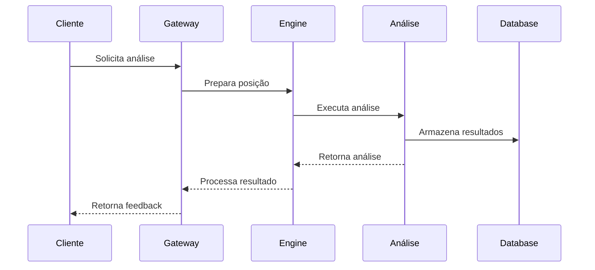
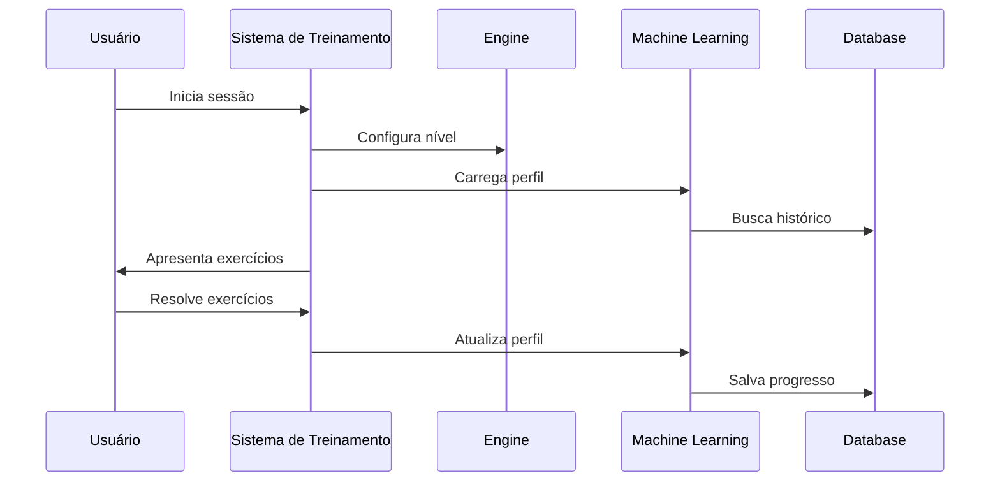

# Fluxos de Integração

## Visão Geral

Este documento detalha os fluxos de integração entre os diferentes componentes do AEON Chess, incluindo interações entre serviços, processos de análise e sistemas de treinamento.

## Fluxos Principais

### Análise de Partida



### Sistema de Treinamento



## Integrações de Serviço

### Motor de Análise

- **Entrada de Dados**
  ```json
  {
    "position": "fen_string",
    "depth": 20,
    "time_limit": 5000,
    "player_profile": {
      "skill_level": 1800,
      "style_preferences": ["positional", "tactical"]
    }
  }
  ```

- **Saída de Dados**
  ```json
  {
    "evaluation": 0.5,
    "best_moves": [
      {
        "move": "e4",
        "evaluation": 0.5,
        "analysis": "Controle central"
      }
    ],
    "position_features": {
      "center_control": 0.7,
      "piece_activity": 0.8
    }
  }
  ```

### Sistema de Aprendizado

- **Entrada de Treinamento**
  ```json
  {
    "game_record": {
      "moves": ["e4", "e5", "Nf3"],
      "evaluations": [0.1, 0.2, 0.0],
      "time_per_move": [1000, 2000, 1500]
    },
    "player_data": {
      "current_rating": 1800,
      "historical_performance": {
        "tactical_accuracy": 0.75,
        "positional_understanding": 0.65
      }
    }
  }
  ```

## Protocolos de Comunicação

### Websockets

```javascript
// Exemplo de evento de análise em tempo real
wsClient.on('analysis_update', {
  type: 'position_update',
  data: {
    fen: 'current_position',
    evaluation: 0.5,
    best_line: ['e4', 'e5', 'Nf3'],
    depth: 20
  }
});
```

### gRPC

```protobuf
service ChessAnalysis {
  rpc AnalyzePosition (PositionRequest) returns (AnalysisResponse);
  rpc GetTrainingPlan (PlayerProfile) returns (TrainingProgram);
  rpc StreamAnalysis (PositionRequest) returns (stream AnalysisUpdate);
}
```

## Integração com Engines

### UCI Protocol

```bash
# Exemplo de comunicação UCI
> position startpos moves e2e4 e7e5
> go depth 20
< info depth 20 seldepth 25 multipv 1 score cp 22 nodes 1259
< bestmove g1f3
```

### Custom Engine Protocol

```python
class EngineInterface:
    async def analyze_position(self, fen: str, config: AnalysisConfig) -> Analysis:
        pass
    
    async def get_training_position(self, level: int) -> TrainingPosition:
        pass
```

## Integração com Banco de Dados

### Esquema de Partidas

```sql
CREATE TABLE games (
    id UUID PRIMARY KEY,
    white_player_id UUID REFERENCES players(id),
    black_player_id UUID REFERENCES players(id),
    moves JSONB,
    analysis JSONB,
    metadata JSONB,
    created_at TIMESTAMP,
    updated_at TIMESTAMP
);
```

### Cache de Análise

```redis
# Estrutura do cache
HSET analysis:position:<fen> \
    evaluation 0.5 \
    best_move e4 \
    depth 20 \
    timestamp 1628447892
```

## Monitoramento e Observabilidade

### Métricas

```javascript
// Prometheus metrics
const analysisLatency = new Histogram({
    name: 'chess_analysis_latency_seconds',
    help: 'Tempo de análise de posição'
});

const engineRequests = new Counter({
    name: 'chess_engine_requests_total',
    help: 'Total de requisições ao engine'
});
```

### Logs

```python
# Structured logging
logger.info('análise_completa', extra={
    'position_id': position.id,
    'depth': 20,
    'time_spent': 1.5,
    'nodes_evaluated': 1000000
})
```

## Segurança

### Validação de Entrada

```typescript
interface AnalysisRequest {
    fen: string;           // Posição FEN válida
    depth?: number;        // 1-50
    time_limit?: number;   // ms, max 30000
    multi_pv?: number;     // 1-5
}
```

### Rate Limiting

```python
@rate_limit(requests=100, period=60)  # 100 requests por minuto
async def analyze_position(position: str) -> Analysis:
    pass
```

## Documentação Relacionada

- [Arquitetura do Sistema](./README.md)
- [Dependências](./dependencies.md)
- [Relações entre Módulos](./module-relationships.md)
