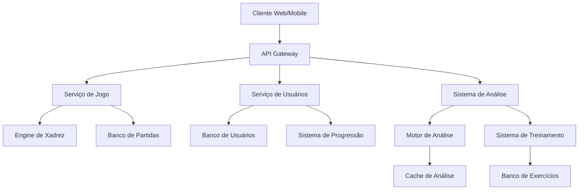
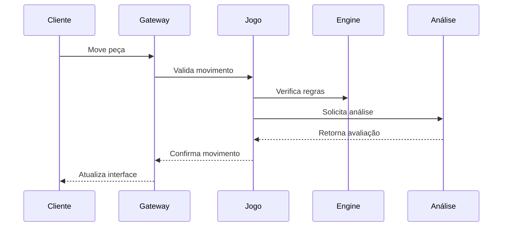
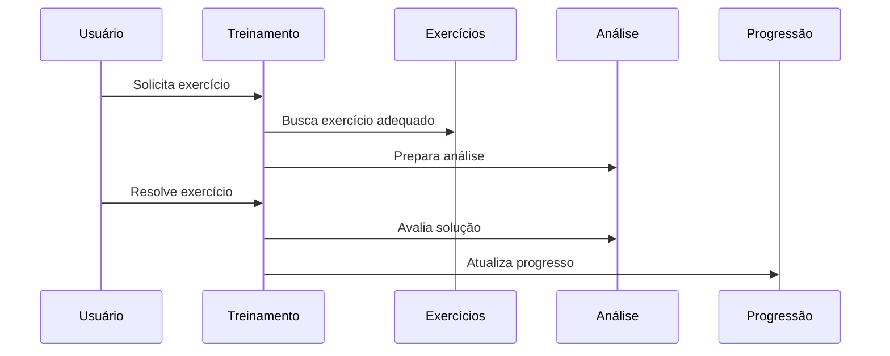

# Relacionamentos entre Módulos

## Visão Geral

Este documento detalha as relações e dependências entre os diferentes módulos do AEON Chess, incluindo fluxos de dados, interfaces e protocolos de comunicação.

## Diagrama de Módulos



## Descrição dos Módulos

### Frontend

#### Cliente Web/Mobile
- **Responsável por**: Interface do usuário
- **Dependências**: API Gateway
- **Tecnologias**: React, React Native

### Backend

#### API Gateway
- **Responsável por**: Roteamento e agregação de APIs
- **Dependências**: Serviços internos
- **Tecnologias**: Express, FastAPI

#### Serviço de Jogo
- **Responsável por**: Lógica do jogo
- **Dependências**: Engine, Banco de dados
- **Tecnologias**: Go

### Análise e Treinamento

#### Sistema de Análise
- **Responsável por**: Análise de posições
- **Dependências**: Motor de análise, Cache
- **Tecnologias**: Python, TensorFlow

#### Sistema de Treinamento
- **Responsável por**: Exercícios e desenvolvimento
- **Dependências**: Banco de exercícios
- **Tecnologias**: Python, PyTorch

## Interfaces entre Módulos

### API Gateway ↔ Serviços

```typescript
interface ServiceInterface {
    // Métodos comuns a todos os serviços
    healthCheck(): Promise<HealthStatus>;
    getMetrics(): Promise<Metrics>;
}
```

### Serviço de Jogo ↔ Engine

```go
type EngineInterface interface {
    // Métodos do engine de xadrez
    AnalyzePosition(fen string) (*Analysis, error)
    ValidateMove(move string) bool
    GetBestMove(position string) string
}
```

### Sistema de Análise ↔ Motor

```python
class AnalysisInterface:
    # Métodos de análise
    async def analyze_position(self, position: Position) -> Analysis: ...
    async def get_evaluation(self, position: Position) -> float: ...
    async def suggest_moves(self, position: Position) -> List[Move]: ...
```

## Fluxos de Dados

### Jogo em Tempo Real



### Treinamento



## Dependências Compartilhadas

### Bibliotecas Comuns

```typescript
// Tipos compartilhados
interface Position {
    fen: string;
    moves: string[];
    metadata: Record<string, any>;
}

interface Analysis {
    evaluation: number;
    bestMoves: Move[];
    depth: number;
}
```

### Configurações

```yaml
# Configurações compartilhadas
analysis:
  default_depth: 20
  cache_ttl: 3600
  max_variations: 5

training:
  session_duration: 1800
  exercises_per_session: 10
  difficulty_step: 100
```

## Monitoramento

### Métricas por Módulo

```typescript
interface ModuleMetrics {
    requests: Counter;
    latency: Histogram;
    errors: Counter;
    resourceUsage: Gauge;
}
```

### Healthchecks

```typescript
interface HealthCheck {
    status: 'healthy' | 'degraded' | 'unhealthy';
    checks: Record<string, {
        status: string;
        latency: number;
        lastCheck: Date;
    }>;
}
```

## Documentação Relacionada

- [Fluxos de Integração](./integration-flows.md)
- [Dependências](./dependencies.md)
- [API Reference](../api/README.md)
